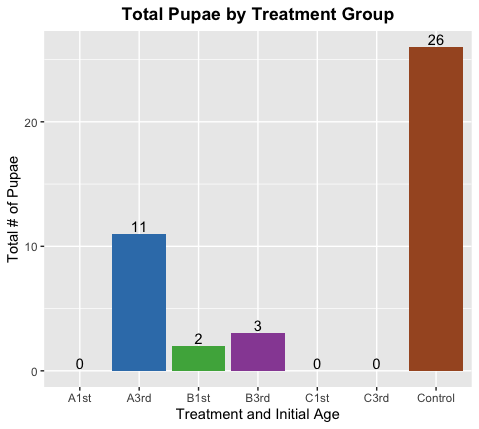
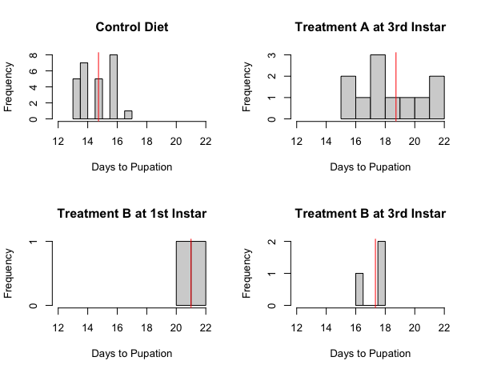
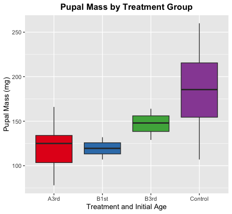
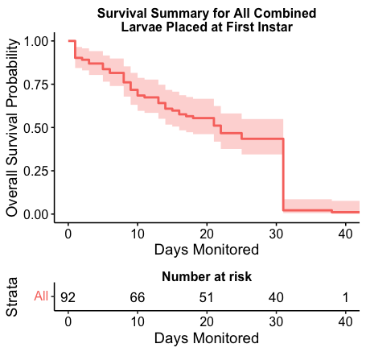
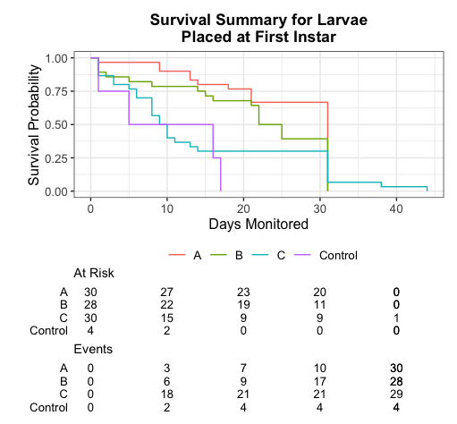

# Introduction

Global climate change is a major topic of concern for modern ecologists. Worldwide average temperature changes are likely to impact the behavior and distribution of many insect species; for those with unique host-pathogen systems, disease transmission may change as a result [@elderd_warmer_2014]. Rising atmospheric carbon dioxide may lead to increased plant biomass and consequential nutrient dilution in resources for insect herbivores [@welti_nutrient_2020]. As carbon increases in plant material, the nitrogen-to-carbon ratio decreases, ultimately diluting the amount of protein consumed compared to carbohydrates [@shikano_impact_2015].

For the fall armyworm (*Spodoptera frugiperda*; "FAW"), such changes in temperature and resource quality are likely to alter the insect's overall performance and development. The fall armyworm is a moth species of the Noctuidae family; during its larval stage, it acts as a ravenous herbivore that prefers grasses but will consume a wide range of vegetation. The FAW is a prominent agricultural pest in its native regions of North and South America and acts as a devastating invasive species to other continents where it has been introduced [@noauthor_spodoptera_nodate]. It primarily attacks crops such as corn/maize, soybeans, sorghum, wheat, and others.

The fall armyworm has a specialist baculovirus, the *Spodoptera frugiperda* multiple nucleopolyhedrovirus (SfMNPV), that is both naturally occurring and used as a biopesticide. Fall armyworms are frequently cannibalistic in their larval stage, an important mode of baculovirus transmission [@valicente_cannibalism_2013]. When competing for scarce resources, FAW larvae are more likely to cannibalize their conspecifics to gain nutritional benefit [@ren_functional_2020]. As resource quality diminishes and temperatures rise, it is possible that FAW larvae will increase cannibalism of conspecifics and therefore increase baculovirus transmission.

As a first step to exploring potential effects of climate change on this system, it is necessary to explore how varying resource quality &mdash; most notably the protein:carbohydrate ratio &mdash; may impact the performance of the fall armyworm. In this paper, I will describe my experimental testing of resource quality on fall armyworm performance and its connection to the broader subject of climate change and disease transmission.

# Methods & Materials

## **FAW Larvae Source**

Fall armyworm larvae were sourced from Dr. Bret Elderd's laboratory-reared colony. The colony originated from wild-caught individuals (F0) from corn fields around Purdue University in West Lafayette, Indiana, USA. This "Purdue" colony was reared for a long-term coevolution project, including one line kept at 26°C during the day and 16°C at night that was infected each generation with a 50% lethal dose of SfMNPV ("26/16 coevolved line"). I used new first-instar larvae from this particular colony line (F17) for my experiment. Fall armyworms have a total of six larval instars before the pupal stage.

## **Artificial Diet Treatments**

There are four total artificial diet treatments used in this experiment, including three macronutrient-manipulated formulas ("manipulated" diets) and one premade standard formula ("control" diet). The control diet is produced and sold by Southland Products, Inc. ("Southland diet") [@noauthor_southland_nodate] and is the typical diet fed to colony FAWs in Dr. Bret Elderd's lab, where these larvae were sourced.

I based my macronutrient ratios on experimental diet treatments described in the Shikano and Cory 2015 [@shikano_impact_2015] paper on cabbage loopers, a similar Noctuid moth to the fall armyworm. While their protein:carbohydrate ratios were based on the cabbage looper's preferred host plant (*Brassicacae* species), the range is sufficient for fall armyworms as well; soybean plants, which are readily eaten by fall armyworms and used in Elderd lab research, have a dry composition of roughly 30% protein and 30% carbohydrates [@wrigley_encyclopedia_2004]. I sourced the original diet recipe directly from Dr. Ikkei Shikano with slight modifications. Casein (protein) and sucrose (carbohydrate) compose 60% of the total dry weight in all manipulated diets, with the ratio of each (protein:carbohydrate) changing depending on the treatment assigned (A = 50%:10% or 5:1, B = 30%:30% or 1:1, C = 10%:50% or 1:5). The remaining 40% of dry ingredients are as follows: cellulose (25%), cholesterol (1.5%), Wesson salt (5%), ascorbic acid (1%), sorbic acid (0.5%), sodium alginate (2.5%), Vanderzant vitamin mix (3.5%), and linseed oil (1%). Southland (control) diet has a reported dry nutritional composition of 23.5% protein and 57% carbs ($\approx$ 1:2.5 P:C ratio).

To prepare the A, B, and C treatment diets, dry ingredients were combined with room temperature water (volume = total dry mass x 2.67) and blended thoroughly. Agar (mass = total dry mass x .0675) was dissolved completely in boiling water (volume = total dry mass x 2.33) and then poured into the same blender. This gives a dry-to-wet mass ratio of $\approx$ 1:5. The mixture was blended on high for two minutes. The liquid diet was poured into 1-oz. plastic cups until about a quarter filled then allowed to completely cool and solidify. Diet was stored in a refrigerator at 4°C until use. Jin et al. 2020 was very helpful in my understanding of the physical preparation process for fall armyworm artificial diet [@jin_comparative_2020].

## **Experimental Setup**

Thirty individual larvae were placed into each of the following treatments: Control, A at First Instar, A at Third Instar, B at First Instar, B at Third Instar, C at First Instar, and C at Third Instar (N = 210 total; 30 per unique diet/age treatment). Larvae were taken at first instar from hatching bags and individually placed into a (room temperature) 1-oz. cup of their respective diet. Control larvae were kept on Southland diet the whole time; A/B/C at First Instar larvae were placed on their respective diet immediately; A/B/C at Third Instar larvae were initially placed on Southland diet and individually transferred to their assigned diet as soon as they molted into an early third instar. All larvae were kept at a standard 31°C/21°C daytime/nighttime (14 hours/10 hours) temperature schedule in Conviron brand incubators.

After initial setup, each individual larva was checked daily for mortality and instar status. If it molted into a new instar or died, the date was recorded for that event. If it successfully pupated, the date was recorded and the pupa had its mass measured in milligrams on a precision scale and its sex identified under a dissecting scope. If any pupae eclosed as moths, the date was recorded and so was the moth's status &mdash; either healthy, non-functional wings/deformed, or failed to fully emerge. Monitoring continued until all individuals had either died or become moths.

## **Data Analysis**

In order to evaluate performance of these fall armyworms fed various diets, I focused on measures of pupation (end of diet consumption &mdash; successful outcome) and larval mortality (death as a larva &mdash; unsuccessful outcome). I completed all data analysis in R version 4.3.1 [@r_core_team_r_2023]. 

### Pupation

For measures of pupation, I looked at pupation success rates, time to pupation, and pupal mass. I summarized the total number of successful pupae and moths for each treatment, as displayed in a bar graph. Using base R functions, I created histograms for overall time to pupation for all treatments that produced pupae; this measured total days from first instar until pupal stage. I then performed an ANOVA, Tukey test, and t-tests on the most relevant pupae data to determine significant differences between treatment groups. I did the same analyses &mdash; ANOVA, Tukey test, and t-tests &mdash; to check for significant differences in mean pupal mass between treatments and created a boxplot (*ggplot2* R package [@wickham_ggplot2_2016]) to visualize the data.

### Mortality

To analyze larval mortality, I used the *survival* R package [@therneau_package_2023; @bos_ants_2015] to perform a survival analysis, as well as *ggplot2* [@wickham_ggplot2_2016], *ggsurvfit* [@sjoberg_ggsurvfit_2023], and *survminer* [@kassambara_survminer_2021] packages to visualize the results. I used a survival regression model (*survreg* function) and did a chi-square test on mortality between treatments.

# Results

### Pupation

Individuals pupated successfully in the A at Third Instar ("A3rd"), B at First Instar ("B1st"), B at Third Instar ("B3rd"), and Control groups, as shown in Figure 1. Most Control group individuals (26 out of 30) pupated, while only 11 of 30 individuals in the A3rd group pupated, 2 in the B1st group, and 3 in the B3rd group.

```{r Figure1, echo=FALSE, fig.cap="Total number of individuals that pupated per treatment group (type of diet and initial age).", out.width = '50%', fig.align='center'}

```

All other individuals died during one of their larval instars. 25 of the 26 Control pupae successfully emerged as a moth (either healthy or with deformed wings) and 1 of the A3rd group pupae attempted to eclose but did not succeed. No other pupae became moths.

The overall time to pupation (in days from first instar to pupation) is visualized as a histogram in Figure 2. See Table 1 for a summary of pupation values.

Table 1: Number of pupae and mean, fastest, and slowest times to pupation for each group. Time is given in days from first instar to pupation.

Treatment Group | # Pupae | Mean Time | Fastest | Slowest
------------- | ------------- | ------------- | ------------- | -------------
Control | 26 | 14.7 | 13 | 17
A3rd | 11 | 18.7 | 15 | 22
B1st | 2 | 21 | 20 | 22
B3rd | 3 | 17.3 | 16 | 18


```{r Figure2, echo=FALSE, fig.cap="Histograms of total days to pupation for all relevant treatments. This only includes the treatments that produced pupae (Control, A at Third Instar, B at First Instar, and B at Third Instar). Here, time to pupation is being measured as days from first instar until pupal stage. The vertical red lines represent the mean time to pupation for each treatment.", out.width = '75%', fig.align='center'}

```


Considering the absence of pupae from most treatments started at first instar, I further statistically analyzed only the treatments that started at third instar and controls. For consistency, I examined only the time in pupation from start of third instar until pupal stage. I created a linear regression model of this data subset and used an ANOVA to analyze variance between the means of each group. The ANOVA yielded $p = 2.737e-08$, which is highly significant ($p < 0.05$). I then ran a Tukey test to determine pairwise specifics, which showed significant differences between the Control group and A3rd treatment ($p = 2.408e-08$), as well as between the Control group and B3rd treatment ($p = 1.365e-02$). The difference between A3rd and B3rd groups was not significant ($p = 0.404$) according to the Tukey test. I ran individual t-tests comparing each group as pairs and found that the results for Control vs. A3rd were corroborated ($p = 7.636e-05$); the Control vs. B3rd group results were considered not statistically significant here, although the value is close ($p = 0.0863$). The result for A3rd vs. B3rd was corroborated here as well ($p = 0.312$).

Since pupal mass is linked to reproductive fitness [@garvey_examining_2022], it is important to evaluate pupal masses between treatment groups as well. A boxplot of pupal masses is given in Figure 3; this shows the median values, interquartile ranges, minimums, and maximums for each group. See Table 2 for a summary of pupal masses.

```{r Figure3, echo=FALSE, fig.cap="Boxplot of pupal mass (in milligrams) for each treatment group (type of diet and initial age) that produced pupae.", out.width = '50%', fig.align='center'}

```


Table 2: Number of pupae and mean, heaviest, and lightest pupal masses for each group. Mass is measured in milligrams.


Treatment Group | # Pupae | Mean Mass | Heaviest | Lightest
------------- | ------------- | ------------- | ------------- | -------------
Control | 26 | 181.8 | 260 | 107
A3rd | 11 | 122.3 | 166 | 78
B1st | 2 | 119.5 | 132 | 107
B3rd | 3 | 147 | 164 | 129

I used a linear regression model for pupal mass data and ran an ANOVA here as well. The ANOVA was significant with $p = 6.254e-4$. Performing a Tukey test, however, revealed that the only comparison with a significant difference is the Control vs. A3rd pair ($p = 7.10e-4$). All other pairwise comparisons had non-significant values ($p > 0.05$). The individual t-tests mostly matched those results with no significant values except for Control vs. A3rd ($p = 3.559e-05$) and Control vs. B3rd ($p = .0417$, only marginally significant); Control vs. B1st was just over $p = 0.05$.

### Mortality

Almost all individuals placed on manipulated diet at first instar died, therefore I performed a survival analysis on those treatments and controls in order to consistently evaluate mortality time between groups. I used a parametric survival regression model based on binary mortality data and survival time (comprising the *Surv* survival object [@therneau_package_2023]) and treatment group. The model included 92 mortality events, since 28 of the considered individuals (2 in B1st and 26 in Control) survived to pupation. The *survreg* model provides Weibull distribution values; in this case, the log likelihood test shows that the model is significantly better than the null model ($p = 0.0312$) [@zhang_parametric_2016].

Survival analysis curves are illustrated in Figure 4 (all individuals combined) and Figure 5 (separated by treatment).

```{r Figure4, echo=FALSE, fig.cap="Survival analysis results illustrated for all combined larvae: A/B/C at First Instar and Control.", out.width = '50%', fig.align='center'}

```

```{r Figure5, echo=FALSE, fig.cap="Survival analysis results illustrated for each treatment: A/B/C at First Instar and Control.", out.width = '50%', fig.align='center'}

```

I performed a chi-square test comparing treatment group and mortality (binary event). The resulting chi-squared value is 90.186 on 3 degrees of freedom with $p < 2.2e-16$. The p-value is highly significant and therefore indicates that the two variables of treatment and mortality are dependent.

# Discussion

### Pupation

In general, the manipulated diet treatments yielded lower overall pupation rates (Figure 1), slower pupation time (Table 1), lower pupal mass (Table 2), and higher mortality rates (Figure 5) compared to the control treatment. However, this is to be expected since the control diet is a well-proven formula for rearing laboratory FAW colonies.

When looking at specific differences between A, B, and C treatments, it seems that a higher carbohydrate content and lower protein is not conducive to FAW larval success. The C diet (P:C ratio of 1:5) did not produce any pupae whether started at first instar or third instar, while the B diet at least had some pupae for both initial age groups and the A diet had several pupae when started at third instar age. The higher protein content in the A diet seemed to help more third instar larvae make it to the pupal stage, but perhaps the too-low carbohydrate content prevented those started at first instar from surviving that long.

When looking at statistical analysis results for third instar to pupation, the ANOVA revealed a very low p-value, indicating significant differences between the means of the treatment groups. Specifically, the Tukey test showed a large difference between the Control group and A3rd group and between Control group and B3rd. This demonstrates that the time to pupation was significantly changed when fed manipulated diets A or B as compared to standard diet. Meanwhile, there was not a significant difference between A3rd and B3rd. I interpret this to mean that individuals started at third instar for both A and B diets took a similar number of days to reach pupation; however, there were B1st individuals that were able to survive until pupation unlike A1st, and there were more A3rd pupae than B3rd. It seems that overall performance certainly varies between the diet types.

For pupal masses, the ANOVA was significant, suggesting differences in the mean masses of the treatment groups. However, the Tukey test only indicated a significant difference between Control and A3rd. T-tests suggested that Control vs. B3rd was also significant and that Control vs. B1st almost was as well. I believe this partially has something to do with the low sample sizes for B1st (N = 2 pupae) and B3rd groups (N = 3 pupae) as compared to A3rd (N = 11 pupae) and Control (N = 26 pupae). Moreover, the equal macronutrient values in the B diet (P:C 1:1) might have yielded a more "ideal" nutritional content for producing pupae more equal in mass to Southland-fed individuals.

### Mortality

The most larvae overall died on C diet, followed by A diet placed at first instar. The survival analysis curves show that Control individuals died pretty early on, perhaps due to being generally unfit, while A and B individuals gradually died until the age of attempting to pupate, where they finished dying (noticeable drop in curve on Figure 4 and Figure 5). C larvae, however, essentially tried to hang on as long as possible before dying and grew noticeably slower. Very few C larvae started at third instar made it to the sixth instar, and no larvae started at first instar made it to the sixth instar, unlike all other treatments.

The chi-square test for mortality had a highly significant p-value that indicates dependence between treatment and mortality. This means that treatment group (A, B, C, or Control) correlated significantly with mortality rates. Based on the chi-square test and survival analysis curves, it appears that the "poorer" diets took longer to induce mortality but with higher event numbers (i.e., more died on worse diet), while "better" diets had quicker mortality events in lower numbers.

Given that almost no larvae survived successfully when started on manipulated diet at first instar, these diet recipes should not be used for rearing fall armyworms for their whole larval period; however, considering the differences between development for A, B, and C formulas overall, there is a clear difference in nutritional composition that is affecting performance. These artificial diets can still be used to directly manipulate nutrient intake for future fall armyworm experiments as long as they are fed during a shorter portion of the lifespan right before use in experimental tests.

# Conclusions & Future Directions

Manipulation of protein:carbohydrate ratios in artificial diet tends to result in significant differences in the survival and pupation rates of fall armyworm larvae compared to a standard diet formula. FAW larvae fed a standard diet exhibited faster development times and minimal mortality with very high pupation rates. Manipulated diets caused high levels of mortality and low rates of (delayed) pupation.

When comparing treatment diets to each other, larvae were more likely to survive and pupate when protein was higher than carbohydrates, but an equal ratio of protein:carbohydrates still allowed for some pupation success. Higher carbohydrate levels were not conducive to survival and resulted in 100% mortality. In general, larvae placed on treatment diet at first instar were unable to pupate, while larvae placed at third instar (for A and B treatments) were more likely to pupate.

Moving forward, I will be testing how this variation in resource quality &mdash; along with temperature &mdash; might affect cannibalistic behaviors and, subsequently, virus transmission in this system. Based on the information presented here, I consider the treatment diet formulas to be different enough in nutrition to be used in the next experiment as well. Given the low survival rates when fed treatment diet from first instar age, future larvae will be reared on Southland brand diet from neonate age until early third instar then fed treatment diet for one whole instar. As an early fourth instar, they will be placed in a small arena and essentially given the option between a portion of their assigned artificial diet and an infected conspecific. Larvae will be observed for cannibalism and then placed back on Southland diet to determine either virus-related death or successful pupation. It is my prediction that being fed diet with a higher carbohydrate content relative to protein (i.e., a more diluted resource) will cause FAW larvae to more readily cannibalize and become infected more easily. Published research suggests that warmer temperatures also promote disease transmission and outbreak intensity in this species [@elderd_warmer_2014]. I am interested in seeing how this interaction between both temperature variation and level of resource quality might lead to experimental differences in cannibalism and virus transmission.

In the face of climate change, it is important to understand the potential impacts of nutrient dilution and resource quality variation in insect herbivore species. When considering an agricultural pest as widespread and invasive as the fall armyworm, it is particularly beneficial to understand this concept and predict how it may apply to a field setting.

# Literature Cited
